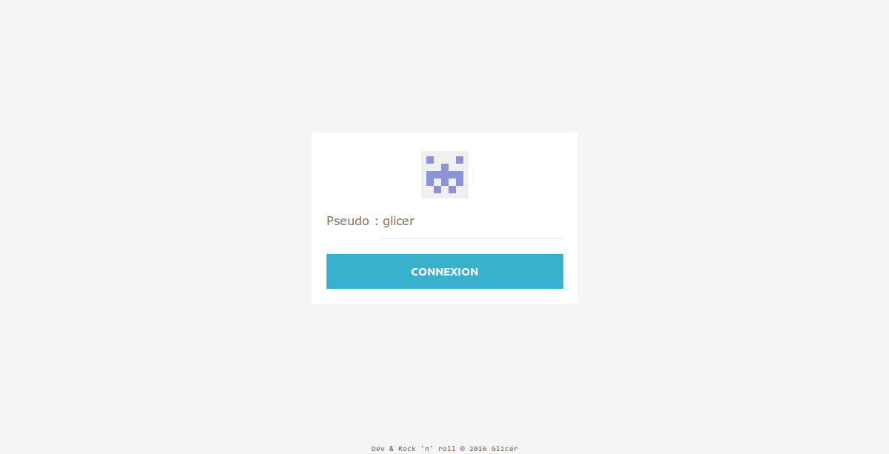

# Chat real-time

## [Demo](http://projects.glicer.com/chat/)

Real-time Chat Server using : 
* [Node.js](nodejs.org)
* [Express](http://expressjs.com/)
* [SQLite](https://www.sqlite.org/)

## Getting Started

### Prerequisites

- [Git](https://git-scm.com/)
- [Node.js and npm](nodejs.org) Node >= 6.x.x, npm >= 3.x.x

### Developing

Run `npm install` to install server dependencies.

## Running Chat server

`node server.js`

URL server : http://[hostname]:8010

